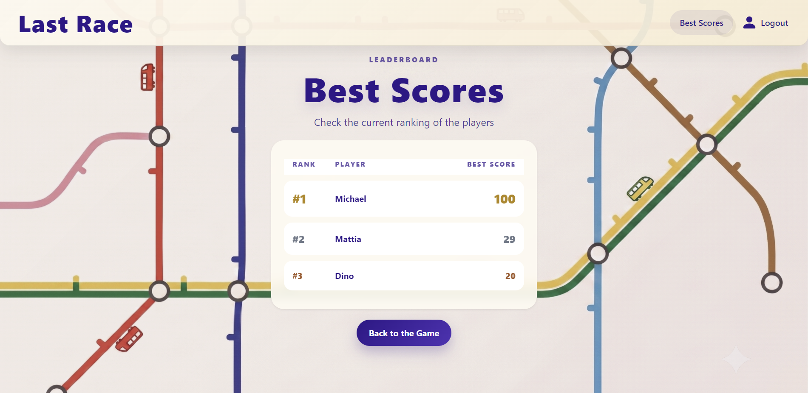
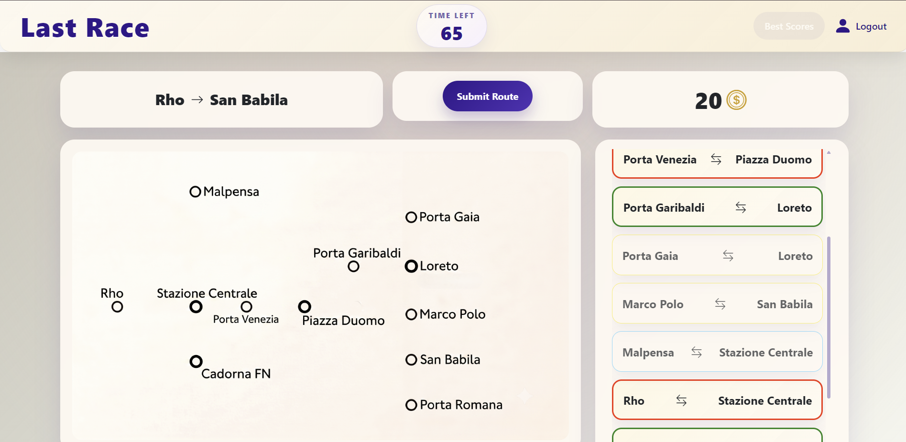

# Exam #1: "Last Race"
## Student: s359927 MAGGIONI MATTIA

## React Client Application Routes

- Route `/`: root page, contains the main layout with the header and it's index is the login page.
- Route `/last-race`: main page of the application, where the different phases of the game take place. Contains the game page with it's components.
- Route `/result` : route where you are redirected at the end of a game. It contains the result page.
- Route `/game-instructions`: contains the page that shows the rules of the game.
- Route `/best-scores` : contains the page that shows the leaderboard with the best scores of the players.
- Route `/logout`: route where you are redirected when you are logging out from the application. Contains the page that execute the log out.

## API Server

- POST `/api/v1/auth/login`

  *API to fetch the user during the login phase.*
  - **request** body content
    ```json
    {
      "username": "username",
      "password": "password"
    }
    ```
  - **response** body content
    ```json
    {
      "id": 0,
      "username": "username"
    }
    ```

- GET `/api/v1/sessions/current`

  *API to check if the client is currently logged in the application.*
  - **response** body content
    ```json
    {
      "id": 0,
      "username": "username"
    }
    ```

- DELETE `/api/v1/sessions/current`

  *API to delete the current session of the client when it does the logout.*

- POST ` /api/v1/game/validate-path`

  *API to send the selected route for validation to the backend.*
  - **request** body content
    ```json
    {
      "startStation": {
          "id": 1,
          "name": "Station 1"
      },
      "endStation": {
          "id": 4,
          "name": "Station 4"
      },
      "selectedSegments": [
          {
              "idS1": 1,
              "idS2": 2
          },
          {
              "idS1": 2,
              "idS2": 3
          },
          {
              "idS1": 3,
              "idS2":4
          }
      ]
    }
    ```
  - **response** body content
    ```json
    {
      "success": true,
      "message": "The route successfully reach the destination!",
      "events": 3
    }
    // or
    {
      "success": false,
      "message": "reason",
      "event": {
        "name": "You Lost!",
        "description": "reason",
        "coin_modifier": -20
      }
    }
    ```

- GET ` /api/v1/events/random-one`

  *API to fetch a random event from the backend.*
  - **response** body content
    ```json
    {
      "name": "Title",
      "description": "description",
      "coin_modifier": 2
    }
    ```

- GET ` /api/v1/network/segments`

  *API to fetch the segments of the network from the backend.*
  - **response** body content
    ```json
    [
      {
        "nameS1": "NameS0",
        "nameS2": "NameS2",
        "idS1": 0,
        "idS2": 2,
        "lineColor": "#FF3005"
      },
      {
        "nameS1": "NameS2",
        "nameS2": "NameS4",
        "idS1": 2,
        "idS2": 4,
        "lineColor": "#FF3005"
      },
    ]
    ```

- GET ` /api/v1/network/stations/random-start-end`

  *API to fetch random start and end stations from the backend.*
  - **response** body content
    ```json
    {
      "startStation": {
        "id": 1,
        "name": "NameS1"
      },
      "endStation": {
        "id": 8,
        "name": "NameS8"
      }
    }
    ```

- GET ` /api/v1/scores/bests`

  *API to fetch the best scores from the backend.*
  - **response** body content
    ```json
    [
      {
        "ranking_position": 1,
        "username": "user1",
        "best_score": 100
      },
      {
        "ranking_position": 2,
        "username": "user2",
        "best_score": 29
      },
      {
        "ranking_position": 3,
        "username": "user3",
        "best_score": 20
      },
    ]
    ```

- POST ` /api/v1/scores`

  *API to save the final score of the player to the backend.*
  - **request** body content
    ```json
    {
        "finalScore": 20
    }
    ```

## Database Tables

- Table `users` - contains *id, username, password_hash, salt*
- Table `stations` - contains *id, name*
- Table `segments` - contains *line_id, station_id_1, station_id_2*
- Table `lines` - contains *id, name, color*
- Table `games` - contains *id, user_id, final_score*
- Table `events` - contains *id, name, description, coin_modifier*

## Main React Components

- `ListOfSomething` (in `List.js`): component purpose and main functionality
- `GreatButton` (in `GreatButton.js`): component purpose and main functionality

- `BestScoresPage` (in `BestScoresPage.jsx`): component where the components of the best scores page are mounted
- `GameInstructionsPage` (in `GameInstructionsPage.jsx`): contains the instructions of the game
- `GamePage` (in `GamePage.jsx`): component where the components used in the game are mounted. It also contains the game states, and the logic for calling the APIs for fetching segments and sending the route for validation.
- `LoginPage` (in `LoginPage.jsx`): component where the components used for the login are mounted.
- `LogoutPage` (in `LogoutPage.jsx`): execute the logic for the log out from the application
- `MainLayout` (in `MainLayout.jsx`): contains the components for the main layout of the application
- `ResultPage` (in `ResultPage.jsx`): component where the components of the result page are mounted
- `EventExecution` (in `EventExecution.jsx`): manage and display the execution of the random events through a timer
- `GameTimer` (in `GameTimer.jsx`): manage and display the countdown timer of the game.
- `Header` (in `Header.jsx`): header of the application. Contains the play button, the game timer, the button to go to the best scores page and the link to logout.
- `LoginForm` (in `LoginForm.jsx`): shows the form and contains the logic for the login
- `ScoresTable` (in `ScoresTable.jsx`): contains the leaderboard of the best scores of the players
- `SegmentList` (in `SegmentList.jsx`): shows the list of segments of the network and contains the logic to select/deselect them

## Screenshot




## Users Credentials

- Mattia, MattiaM27
- Michael, Jackson5
- Dino, Ferrari40

## Use of AI Tools
During the development of this project, I used AI tools, specifically **Gemini (Web interface)** and **Gemini Code Assistant (VS Code extension)**.

I used them mainly for clarifying complex concepts and learn how to implement them in JavaScript/React, such as implementing the Breath-First Search (BFS) algorithm to validate network routes, implementing timers in React components. I used them also while debugging the code, to identify and fix errors and minor bugs that I was struggling to handle. Lastly, I used them to generate the image of the map and the descriptions of the random events.

I never blindly copy-pasted AI-generated code. I always carefully reviewed, adapted and manually re-writed it in my codebase. Every feature was then manually tested to ensure the correct workflow.
